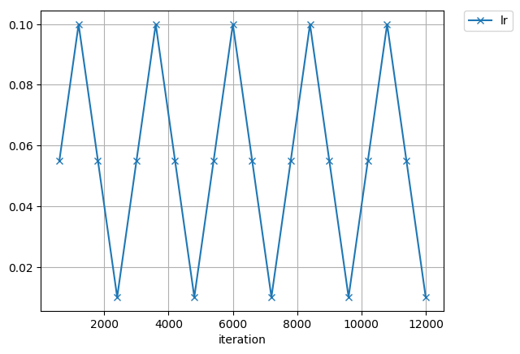
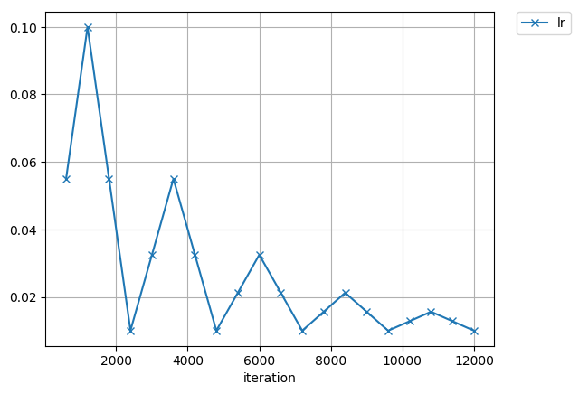
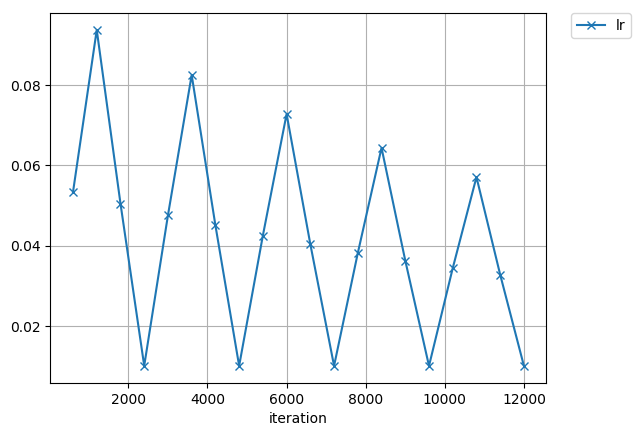

# clr_chainer

[Cyclical Learning Rate (CLR)](https://arxiv.org/abs/1506.01186) implementation with Chainer.

## CLR choices

### triangular


### triangular2


### exp_range


## Usage

Add `CLR` extension to the `trainer`.  
The `value_range` in the following code means `(lr_min, lr_max)`.  
NOTE: An initial value for `attr` of the optimizer is overwritten in the `CLR` initialization.

```python
from clr.training.extensions import CLR

policy = 'triangular'
step_size = 2000
value_range = (0.01, 0.1)
trainer.extend(CLR('lr', value_range, 2 * step_size, policy))
```

## References

* [Leslie N. Smith:
Cyclical Learning Rates for Training Neural Networks. WACV 2017: 464-472](https://arxiv.org/abs/1506.01186)
* [Keras implementation](https://github.com/bckenstler/CLR)
